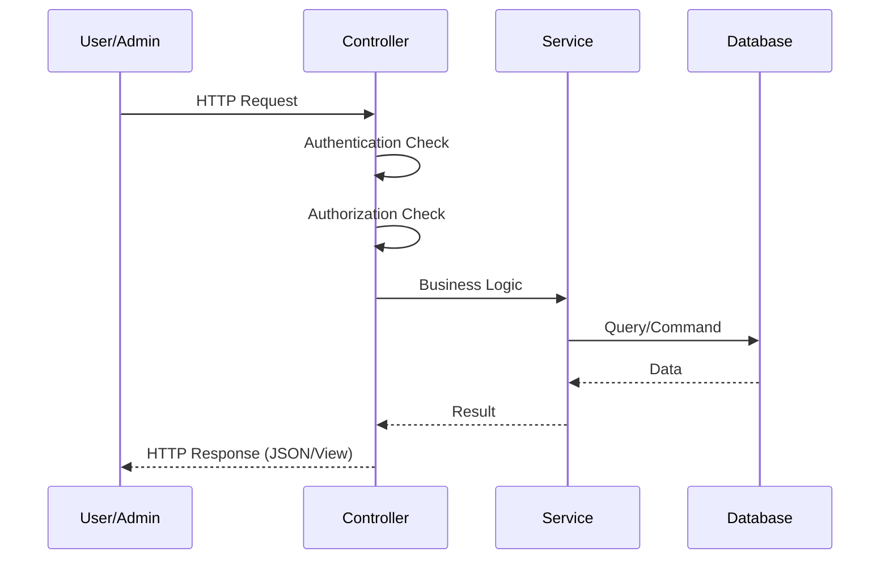
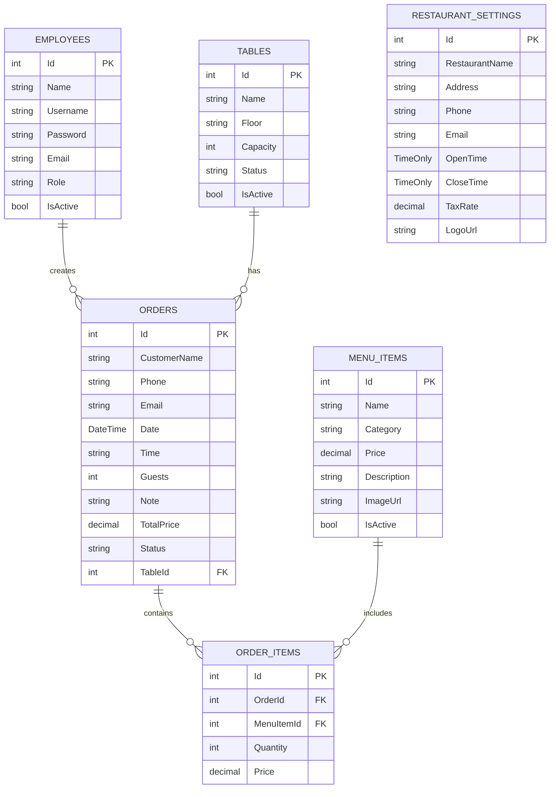

# 🍽️ Restaurant Management System (Hệ thống Quản lý Nhà hàng)

[](https://dotnet.microsoft.com/)
[](https://reactjs.org/)
[](https://www.sqlite.org/)
[](LICENSE)

> **Dự án cuối kỳ:** Xây dựng hệ thống quản lý nhà hàng toàn diện với ASP.NET Core 9.0, React 18 và Entity Framework Core.

---

## 📋 Mục lục

- [Giới thiệu](#-giới-thiệu)
- [Tính năng chính](#-tính-năng-chính)
- [Screenshots](#-screenshots)
- [Kiến trúc hệ thống](#️-kiến-trúc-hệ-thống)
- [Tech Stack](#-tech-stack)
- [Cài đặt & Chạy ứng dụng](#-cài-đặt--chạy-ứng-dụng)
- [Tài khoản Demo](#-tài-khoản-demo)
- [API Documentation](#-api-documentation)
- [Database Schema](#️-database-schema)
- [Cấu trúc thư mục](#-cấu-trúc-thư-mục)
- [Conventions](#-conventions)
- [Kịch bản Demo](#-kịch-bản-demo)
- [Đóng góp](#-đóng-góp)

---

## 📖 Giới thiệu

**Restaurant Management System** là một hệ thống quản lý nhà hàng toàn diện, được xây dựng theo mô hình **Client-Server Architecture** với **SPA Frontend** và **RESTful API Backend**.

### Mục tiêu dự án:
- ✅ Quản lý đặt bàn, thực đơn, đơn hàng, nhân viên, khách hàng
- ✅ Phân quyền người dùng rõ ràng (Admin, Nhân viên, Đầu bếp)
- ✅ Dashboard thống kê doanh thu, đơn hàng theo thời gian thực
- ✅ RESTful API với Server-side Pagination
- ✅ Responsive UI, hỗ trợ đa thiết bị

---

## ✨ Tính năng chính

### 🔐 **Authentication & Authorization**
- Đăng ký/Đăng nhập với BCrypt password hashing
- 3 phân quyền: **Admin**, **Nhân viên**, **Đầu bếp**
- Session-based authentication (Cookie)
- Policy-based authorization (AdminOnly, AdminAndStaff, AllRoles)

### 📊 **Dashboard & Analytics**
- Biểu đồ doanh thu theo tháng (Line Chart - 6 tháng gần nhất)
- Thống kê đơn hàng theo trạng thái (Pie Chart)
- Top 5 món ăn bán chạy (Bar Chart)
- Tổng hợp: Tổng đơn, Doanh thu, Khách hàng, Bàn trống

### 🍽️ **Quản lý Thực đơn**
- CRUD món ăn đầy đủ (Create, Read, Update, Delete)
- Upload & preview ảnh món ăn (JPG, PNG, max 1MB)
- Drag & Drop upload
- Phân loại theo 8 danh mục
- Tìm kiếm, lọc, sắp xếp

### 📋 **Quản lý Đơn hàng**
- Xem đơn hiện thời & lịch sử
- Thêm/Sửa/Xóa món trong đơn
- Chuyển bàn
- Thanh toán (Tiền mặt, VNPAY, Chuyển khoản)
- In hóa đơn
- 2 chế độ xem: Card View & Table View

### 🪑 **Quản lý Đặt bàn**
- Đặt bàn theo tầng (Tầng 1, Tầng 2, Sân thượng)
- Chọn số khách, ngày giờ
- Quản lý trạng thái bàn (Available, Reserved, Occupied)
- Tự động gợi ý bàn phù hợp

### 👥 **Quản lý Nhân viên**
- CRUD nhân viên
- Phân quyền theo vai trò
- Thống kê: Tổng NV, Hoạt động, Không hoạt động
- Tìm kiếm, lọc theo vai trò

### 👤 **Quản lý Khách hàng**
- Tự động tạo profile từ đơn hàng
- Thống kê: Tổng khách, Mới (30 ngày), Thân thiết (≥5 đơn), VIP (≥1M)
- Xem lịch sử đơn hàng của khách
- Phân loại khách hàng thông minh

### ⚙️ **Thiết lập Hệ thống**
- Cấu hình thông tin nhà hàng
- Upload logo nhà hàng
- Giờ hoạt động, Thuế VAT
- Khôi phục cài đặt mặc định

### 🔌 **RESTful API**
- **Server-side Pagination** (page, pageSize, search, status, sort)
- **Swagger UI Documentation** (`/swagger`)
- JSON response format
- Error handling & validation
- Data annotations validation

---

## 📸 Screenshots

### 1. Trang đăng nhập

> Giao diện đăng nhập với gradient hiện đại, hỗ trợ 3 role

### 2. Dashboard

> Dashboard với biểu đồ Chart.js: Doanh thu, Đơn hàng, Top món

### 3. Quản lý Đơn hàng (Card View)

> Xem đơn hàng dạng Card với search, filter, sort

### 4. Quản lý Đơn hàng (Table View)

> Xem đơn hàng dạng bảng chi tiết

### 5. Quản lý Thực đơn

> Quản lý món ăn với upload ảnh, CRUD đầy đủ

### 6. Thêm món mới

> Form thêm món với Drag & Drop upload, validation realtime

### 7. Quản lý Nhân viên

> Quản lý nhân viên với phân quyền, statistics

### 8. Quản lý Khách hàng

> Quản lý khách hàng với phân loại thông minh (VIP, Loyal, New)

### 9. Trang Đặt bàn (Customer)

> Giao diện đặt bàn cho khách hàng (React SPA)

### 10. Trang Thanh toán

> Trang thanh toán với nhiều phương thức

### 11. Swagger API Documentation

> API documentation với Swagger UI

---

## 🏗️ Kiến trúc hệ thống

### Sơ đồ tổng thể

```mermaid
graph TB
    subgraph "Client Layer"
        A[React SPA<br/>Vite + TypeScript]
        B[Admin Dashboard<br/>Razor Views]
    end
    
    subgraph "Server Layer"
        C[ASP.NET Core 9.0<br/>MVC + Web API]
        D[Authentication<br/>Cookie-based]
        E[Authorization<br/>Policy-based]
    end
    
    subgraph "Data Layer"
        F[Entity Framework Core]
        G[SQLite Database]
    end
    
    subgraph "External Services"
        H[Chart.js<br/>Visualization]
        I[Swagger<br/>API Docs]
    end
    
    A -->|API Calls| C
    B -->|Server-side Render| C
    C --> D
    C --> E
    C --> F
    F --> G
    C --> I
    B --> H
    
    style A fill:#61DAFB,stroke:#333,stroke-width:2px
    style C fill:#512BD4,stroke:#333,stroke-width:2px
    style G fill:#003B57,stroke:#333,stroke-width:2px
```



### Luồng dữ liệu



### Kiến trúc 3-layer

```
┌─────────────────────────────────────┐
│   Presentation Layer                │
│   - MVC Controllers                 │
│   - API Controllers                 │
│   - Razor Views                     │
│   - React SPA                       │
└─────────────────────────────────────┘
              ↓
┌─────────────────────────────────────┐
│   Business Logic Layer              │
│   - Services (DataSeederService)    │
│   - Authentication & Authorization  │
│   - Validation                      │
└─────────────────────────────────────┘
              ↓
┌─────────────────────────────────────┐
│   Data Access Layer                 │
│   - Entity Framework Core           │
│   - DbContext                       │
│   - Models                          │
│   - Migrations                      │
└─────────────────────────────────────┘
```

---

## 🛠 Tech Stack

### Backend
| Technology | Version | Lý do chọn |
|------------|---------|------------|
| **ASP.NET Core** | 9.0 | Framework hiện đại, hiệu năng cao, cross-platform |
| **Entity Framework Core** | 9.0 | ORM mạnh mẽ, hỗ trợ migrations, LINQ queries |
| **SQLite** | 3.x | Nhẹ, không cần cài đặt server, phù hợp dự án học tập |
| **BCrypt.Net** | 0.1.0 | Hash password an toàn, chống brute-force |
| **Swashbuckle** | 6.x | Tự động generate API documentation |

### Frontend
| Technology | Version | Lý do chọn |
|------------|---------|------------|
| **React** | 18.0 | Component-based, Virtual DOM, ecosystem lớn |
| **Vite** | 6.x | Build tool nhanh, HMR, ES modules native |
| **TypeScript** | 5.x | Type safety, IntelliSense, maintainability |
| **Chart.js** | 4.x | Thư viện charts đơn giản, responsive, đẹp |
| **Boxicons** | 2.x | Icon library miễn phí, đa dạng |
| **Bootstrap 5** | 5.3 | CSS framework phổ biến, responsive grid |

### DevOps & Tools
- **Git & GitHub** - Version control
- **Docker** - Containerization
- **.NET CLI** - Build & deployment
- **npm** - Package management

---

## 🚀 Cài đặt & Chạy ứng dụng

### Yêu cầu hệ thống
- **.NET 9 SDK** - [Download](https://dotnet.microsoft.com/download/dotnet/9.0)
- **Node.js 18+** - [Download](https://nodejs.org/) (chỉ cần khi build React SPA)
- **Git** - [Download](https://git-scm.com/)

---

### 🔧 Cách 1: Chạy Local (Khuyến nghị)

#### Bước 1: Clone repository

```bash
git clone https://github.com/tudo2212485/DA_QLNH3TL.git
cd DA_QLNH3TL/DACN_QLNH2/QLNHWebApp
```

#### Bước 2: Restore packages

```bash
dotnet restore
```

#### Bước 3: Cấu hình Database (đã có sẵn)

File `appsettings.json`:
```json
{
  "ConnectionStrings": {
    "DefaultConnection": "Data Source=../data/QLNHDB.db"
  }
}
```

Database SQLite đã được tạo sẵn tại: `../data/QLNHDB.db`

#### Bước 4: Apply Migrations (nếu chưa có DB)

```bash
dotnet ef database update
```

#### Bước 5: Chạy ứng dụng

```bash
dotnet run
```

#### Bước 6: Truy cập

- **Admin Dashboard**: http://localhost:5000/Auth/Login
- **Customer SPA**: http://localhost:5000
- **Swagger API**: http://localhost:5000/swagger

---

### 🐳 Cách 2: Chạy với Docker

#### Dockerfile đã có sẵn:

```bash
# Build và run với Docker
docker build -t restaurant-app .
docker run -p 5000:8080 restaurant-app
```

#### Hoặc dùng Docker Compose:

```bash
docker-compose up
```

---

### 🌱 Data Seeding

**Dữ liệu mẫu tự động được seed khi chạy lần đầu**, bao gồm:

- ✅ **4 tài khoản nhân viên** (1 Admin, 2 Nhân viên, 1 Đầu bếp)
- ✅ **20+ món ăn** (8 danh mục)
- ✅ **19 bàn** (3 tầng: Tầng 1, Tầng 2, Sân thượng)
- ✅ **15 đơn hàng mẫu** (trạng thái "Đã thanh toán", dữ liệu 6 tháng)
- ✅ **Thiết lập hệ thống mặc định** (Logo, giờ hoạt động, VAT)

**Nếu muốn reset database:**

```bash
# Xóa database cũ
Remove-Item ../data/QLNHDB.db

# Tạo lại từ migrations
dotnet ef database update
```

Data sẽ được tự động seed khi khởi động lại app.

---

### ⚙️ Biến môi trường

Không cần cấu hình biến môi trường phức tạp. Mọi cài đặt nằm trong `appsettings.json`:

```json
{
  "Logging": {
    "LogLevel": {
      "Default": "Information",
      "Microsoft.AspNetCore": "Warning"
    }
  },
  "AllowedHosts": "*",
  "ConnectionStrings": {
    "DefaultConnection": "Data Source=../data/QLNHDB.db"
  }
}
```

---

## 👥 Tài khoản Demo

| Username | Password | Vai trò | Quyền hạn |
|----------|----------|---------|-----------|
| `admin` | `admin123` | Admin | ✅ Toàn quyền (Dashboard, Đơn hàng, Đặt bàn, Thực đơn, Nhân viên, Khách hàng, Thiết lập) |
| `nhanvien` | `nv123` | Nhân viên | ✅ Quản lý đơn hàng, đặt bàn, thực đơn<br/>❌ Không thể quản lý nhân viên & thiết lập |
| `daubep` | `db123` | Đầu bếp | ✅ Chỉ xem thực đơn<br/>❌ Không có quyền khác |
| `dotrungb` | `dotrungb123` | Nhân viên | ✅ Quản lý đơn hàng, đặt bàn, thực đơn<br/>❌ Không thể quản lý nhân viên & thiết lập |

### Cách đăng nhập:

1. Truy cập: http://localhost:5000/Auth/Login
2. Nhập username và password
3. Hệ thống tự động redirect dựa trên role:
   - **Admin** → Dashboard (`/Admin/Dashboard`)
   - **Nhân viên** → Quản lý Đơn hàng (`/OrderManagement`)
   - **Đầu bếp** → Thực đơn (`/AdminMenu`)

---

## 📖 API Documentation

### Swagger UI

**URL:** http://localhost:5000/swagger


### Các endpoint chính

#### 🔐 Authentication

```http
POST /Auth/Login
Content-Type: application/x-www-form-urlencoded

username=admin&password=admin123
```

#### 📋 Orders API (Có Pagination)

```http
GET /api/Orders?page=1&pageSize=10&search=&status=&sortBy=date&sortOrder=desc
```

**Response:**
```json
{
  "items": [
    {
      "id": 1,
      "customerName": "Nguyễn Văn A",
      "phone": "0987654321",
      "totalPrice": 255000,
      "status": "Đã thanh toán",
      "date": "2025-10-29T19:30:00"
    }
  ],
  "page": 1,
  "pageSize": 10,
  "totalCount": 50,
  "totalPages": 5,
  "hasPrevious": false,
  "hasNext": true
}
```

#### 📊 Statistics API

```http
GET /api/Orders/statistics
```

**Response:**
```json
{
  "totalOrders": 50,
  "totalRevenue": 15000000,
  "pendingOrders": 5,
  "completedOrders": 45,
  "averageOrderValue": 333333
}
```

#### 🍽️ Menu API

```http
GET /api/Menu
GET /api/Menu/{id}
```

#### 🪑 Table API

```http
GET /api/Table/GetTablesByFloor?floor=Tầng 1&guests=4
```

**Response:**
```json
[
  {
    "id": 1,
    "name": "Bàn 1",
    "floor": "Tầng 1",
    "capacity": 4,
    "status": "Available"
  }
]
```

### OpenAPI/Swagger JSON

**URL:** http://localhost:5000/swagger/v1/swagger.json

---

## 🗄️ Database Schema

### ERD Diagram



### Các bảng chính

| Bảng | Mô tả | Số cột |
|------|-------|--------|
| `Employees` | Quản lý nhân viên, tài khoản đăng nhập | 7 |
| `MenuItems` | Danh sách món ăn, giá, ảnh | 7 |
| `Tables` | Danh sách bàn, tầng, sức chứa | 6 |
| `Orders` | Đơn đặt bàn/đơn hàng | 11 |
| `OrderItems` | Chi tiết món trong đơn | 5 |
| `RestaurantSettings` | Cài đặt nhà hàng | 9 |

### Migration Scripts

**Tạo migration mới:**
```bash
dotnet ef migrations add MigrationName
```

**Apply migrations:**
```bash
dotnet ef database update
```

**Rollback migration:**
```bash
dotnet ef database update PreviousMigrationName
```

**Xem SQL script:**
```bash
dotnet ef migrations script
```

---

## 📁 Cấu trúc thư mục

```
DACN_QLNH2/
├── QLNHWebApp/                          # Main ASP.NET Core project
│   ├── Controllers/                     # MVC & API Controllers
│   │   ├── AdminController.cs           # Admin dashboard
│   │   ├── AuthController.cs            # Login/Logout
│   │   ├── OrderManagementController.cs # Quản lý đơn hàng
│   │   ├── AdminMenuController.cs       # Quản lý thực đơn
│   │   ├── AdminCustomerController.cs   # Quản lý khách hàng
│   │   ├── AdminBookingController.cs    # Quản lý đặt bàn
│   │   ├── SettingsController.cs        # Thiết lập hệ thống
│   │   └── Api/                         # RESTful API Controllers
│   │       ├── OrdersApiController.cs   # Pagination API
│   │       ├── MenuApiController.cs
│   │       ├── TableApiController.cs
│   │       └── ContactApiController.cs
│   ├── Models/                          # Data Models
│   │   ├── RestaurantModels.cs          # All entity models
│   │   └── RestaurantDbContext.cs       # EF Core DbContext
│   ├── Views/                           # Razor Views
│   │   ├── Admin/                       # Admin panel views
│   │   │   ├── Dashboard.cshtml
│   │   │   ├── Employees.cshtml
│   │   │   └── Orders.cshtml
│   │   ├── Auth/                        # Login views
│   │   │   ├── Login.cshtml
│   │   │   └── AccessDenied.cshtml
│   │   ├── OrderManagement/             # Order management
│   │   │   ├── Index.cshtml
│   │   │   ├── Edit.cshtml
│   │   │   └── History.cshtml
│   │   ├── AdminMenu/                   # Menu management
│   │   │   ├── Index.cshtml
│   │   │   ├── Create.cshtml
│   │   │   ├── Edit.cshtml
│   │   │   └── Delete.cshtml
│   │   ├── AdminCustomer/               # Customer management
│   │   │   └── Index.cshtml
│   │   ├── Settings/                    # System settings
│   │   │   └── Index.cshtml
│   │   └── Shared/
│   │       ├── _AdminLayout.cshtml
│   │       └── _Layout.cshtml
│   ├── Services/                        # Business logic
│   │   └── DataSeederService.cs         # Seed initial data
│   ├── Migrations/                      # EF Core migrations
│   │   ├── 20250922103133_InitialCreate.cs
│   │   ├── 20250924105235_AddAdminSystem.cs
│   │   └── ...
│   ├── wwwroot/                         # Static files
│   │   ├── images/                      # Uploaded images
│   │   │   ├── menu/                    # Menu item images
│   │   │   └── logo/                    # Restaurant logo
│   │   ├── css/                         # Stylesheets
│   │   └── lib/                         # Client libraries
│   ├── Restaurant Management Web App/   # React SPA
│   │   ├── src/
│   │   │   ├── components/              # React components
│   │   │   ├── services/                # API services
│   │   │   ├── types/                   # TypeScript types
│   │   │   └── App.tsx
│   │   ├── build/                       # Production build
│   │   ├── package.json
│   │   └── vite.config.ts
│   ├── Program.cs                       # App configuration
│   ├── appsettings.json                 # App settings
│   └── QLNHWebApp.csproj                # Project file
├── data/                                # Database folder
│   └── QLNHDB.db                        # SQLite database
├── docs/                                # Documentation
│   ├── screenshots/                     # App screenshots
│   └── architecture/                    # Architecture diagrams
├── README.md                            # This file
├── CONTRIBUTING.md                      # Contribution guidelines
├── Dockerfile                           # Docker configuration
└── docker-compose.yml                   # Docker Compose
```

---

## 📝 Conventions

### Coding Style

#### C# (.NET)
- **Naming Convention:**
  - PascalCase: Classes, Methods, Properties, Public fields
  - camelCase: Private fields, local variables
  - _camelCase: Private instance fields (with underscore prefix)
  
- **Example:**
  ```csharp
  public class OrderManagementController : Controller
  {
      private readonly RestaurantDbContext _context;
      
      public async Task<IActionResult> Index(string searchString)
      {
          var orders = _context.Orders.AsQueryable();
          return View(orders);
      }
  }
  ```

#### TypeScript/React
- **Naming Convention:**
  - PascalCase: Components, Interfaces, Types
  - camelCase: Functions, variables, props
  
- **Example:**
  ```typescript
  interface PaymentPageProps {
      onPageChange: (page: string) => void;
  }
  
  export const PaymentPage: React.FC<PaymentPageProps> = ({ onPageChange }) => {
      const [order, setOrder] = useState<Order | null>(null);
      return <div>...</div>;
  };
  ```

### Git Commit Messages

Tuân theo **Conventional Commits**:

```
<type>(<scope>): <subject>

<body>

<footer>
```

**Types:**
- `feat`: Tính năng mới
- `fix`: Sửa lỗi
- `docs`: Thay đổi documentation
- `style`: Code formatting (không ảnh hưởng logic)
- `refactor`: Refactor code
- `test`: Thêm/sửa tests
- `chore`: Build process, dependencies

**Examples:**
```bash
feat(order): add pagination to order management page

fix(payment): resolve quantity display bug in payment page

docs(readme): update installation guide with Docker
```

### Branch Strategy

- `main` - Production-ready code
- `develop` - Development branch
- `feature/feature-name` - New features
- `bugfix/bug-name` - Bug fixes
- `hotfix/critical-bug` - Critical production fixes

**Workflow:**
```bash
# Tạo feature branch
git checkout -b feature/add-customer-management

# Commit changes
git add .
git commit -m "feat(customer): add customer statistics"

# Merge vào develop
git checkout develop
git merge feature/add-customer-management

# Merge vào main khi release
git checkout main
git merge develop
```

---

## 🎯 Kịch bản Demo

### Use Case 1: Khách hàng đặt bàn (React SPA)

**Đường dẫn UI:** http://localhost:5000

1. **Chọn tầng & số khách:**
   - Click "Đặt bàn ngay"
   - Chọn tầng (Tầng 1/Tầng 2/Sân thượng)
   - Nhập số khách (1-20)
   
2. **Chọn bàn:**
   - Hệ thống hiển thị danh sách bàn phù hợp
   - Click chọn bàn
   
3. **Chọn món ăn:**
   - Browse thực đơn theo danh mục
   - Thêm món vào đơn
   - Điều chỉnh số lượng
   
4. **Nhập thông tin:**
   - Họ tên, SĐT
   - Ngày giờ đến
   - Ghi chú (optional)
   
5. **Thanh toán:**
   - Xem tóm tắt đơn hàng
   - Chọn phương thức thanh toán
   - Xác nhận

**API Calls:**
```http
GET /api/Table/GetTablesByFloor?floor=Tầng 1&guests=4
GET /api/Menu
POST /api/Order (body: order data)
```

---

### Use Case 2: Admin quản lý đơn hàng

**Đường dẫn UI:** http://localhost:5000/OrderManagement

1. **Đăng nhập:**
   - URL: `/Auth/Login`
   - Username: `admin`, Password: `admin123`
   
2. **Xem danh sách đơn:**
   - Toggle Card View / Table View
   - Search theo tên/SĐT
   - Filter theo trạng thái
   - Sort theo date/price
   
3. **Sửa đơn hàng:**
   - Click "Sửa" trên đơn
   - Thêm/Xóa/Sửa món
   - Chuyển bàn
   - Cập nhật trạng thái
   
4. **Thanh toán:**
   - Click "Thanh toán"
   - Chọn phương thức
   - In hóa đơn
   
5. **Xem lịch sử:**
   - Tab "Lịch sử đơn hàng"
   - Filter theo ngày
   - Xem chi tiết

**API Calls:**
```http
GET /api/Orders?page=1&pageSize=10&status=Pending
GET /OrderManagement/GetOrderDetails/{id}
POST /OrderManagement/AddItem (body: {orderId, menuItemId, quantity})
POST /OrderManagement/Payment (body: {orderId, paymentMethod})
```

---

### Use Case 3: Nhân viên xem thống kê (Dashboard)

**Đường dẫn UI:** http://localhost:5000/Admin/Dashboard

1. **Đăng nhập:**
   - Username: `admin`, Password: `admin123`
   
2. **Xem thống kê tổng quan:**
   - Tổng đơn hàng
   - Tổng doanh thu
   - Tổng khách hàng
   - Bàn trống
   
3. **Xem biểu đồ:**
   - **Line Chart:** Doanh thu 6 tháng gần nhất
   - **Pie Chart:** Tỷ lệ đơn hàng theo trạng thái
   - **Bar Chart:** Top 5 món bán chạy
   
4. **Quick Actions:**
   - Tạo đơn mới
   - Quản lý thực đơn
   - Quản lý nhân viên

**API Calls:**
```http
GET /Admin/Dashboard (Server-side rendering)
GET /api/Orders/statistics
```

---

### Use Case 4: Thêm món ăn mới

**Đường dẫn UI:** http://localhost:5000/AdminMenu/Create

1. **Upload ảnh:**
   - Drag & Drop ảnh vào khung
   - Hoặc click để chọn file
   - Preview realtime
   - Validate: Max 1MB, JPEG/PNG
   
2. **Nhập thông tin:**
   - Tên món (*required)
   - Danh mục (*required)
   - Giá (*required, auto-format)
   - Đơn vị
   - Mô tả
   
3. **Lưu:**
   - Click "Lưu món ăn"
   - Validation client-side & server-side
   - Redirect về danh sách

**API Calls:**
```http
POST /AdminMenu/Create
Content-Type: multipart/form-data

imageFile: [binary]
Name: "Cá hồi nướng"
Category: "Món nướng"
Price: 250000
Description: "..."
```

---

### Use Case 5: Test API với Swagger

**Đường dẫn UI:** http://localhost:5000/swagger

1. **Browse Endpoints:**
   - Expand `/api/Orders`
   - Xem request/response schema
   
2. **Try it out:**
   - Click "Try it out"
   - Nhập parameters
   - Click "Execute"
   
3. **View Response:**
   - Status code
   - Response body (JSON)
   - Headers
   
4. **Test Pagination:**
   ```
   GET /api/Orders?page=1&pageSize=5&sortBy=date&sortOrder=desc
   ```
   
5. **Test Statistics:**
   ```
   GET /api/Orders/statistics
   ```

---

## 🤝 Đóng góp

Contributions, issues và feature requests đều được chào đón!

### Quy trình đóng góp:

1. Fork repository
2. Tạo branch (`git checkout -b feature/AmazingFeature`)
3. Commit changes (`git commit -m 'feat: add some AmazingFeature'`)
4. Push to branch (`git push origin feature/AmazingFeature`)
5. Mở Pull Request

Xem thêm chi tiết trong [CONTRIBUTING.md](CONTRIBUTING.md)

---

## 👨‍💻 Tác giả

**Nhóm 3TL**

- GitHub: [@tudo2212485](https://github.com/tudo2212485)
- Email: [your-email@example.com]

---

## 📄 License

Dự án này được phát hành dưới giấy phép **MIT License**.

---

## 🙏 Lời cảm ơn

- ASP.NET Core Team
- React Community
- Chart.js Team
- Boxicons
- Entity Framework Core Team
- Swagger/OpenAPI Community
- Tất cả contributors

---

## 📞 Liên hệ & Hỗ trợ

- **Issues:** https://github.com/tudo2212485/DA_QLNH3TL/issues
- **Discussions:** https://github.com/tudo2212485/DA_QLNH3TL/discussions
- **Email:** [your-email@example.com]

---

**⭐ Nếu dự án này hữu ích, đừng quên cho một ngôi sao trên GitHub! ⭐**

---

## 📚 Tài liệu tham khảo

- [ASP.NET Core Documentation](https://docs.microsoft.com/en-us/aspnet/core/)
- [Entity Framework Core Documentation](https://docs.microsoft.com/en-us/ef/core/)
- [React Documentation](https://react.dev/)
- [Chart.js Documentation](https://www.chartjs.org/docs/)
- [Swagger/OpenAPI Specification](https://swagger.io/specification/)

---

*README last updated: October 29, 2025*
